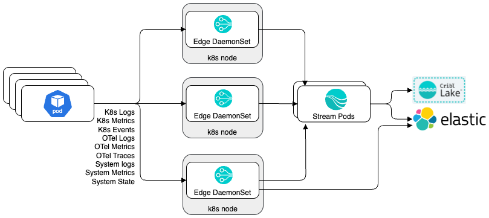
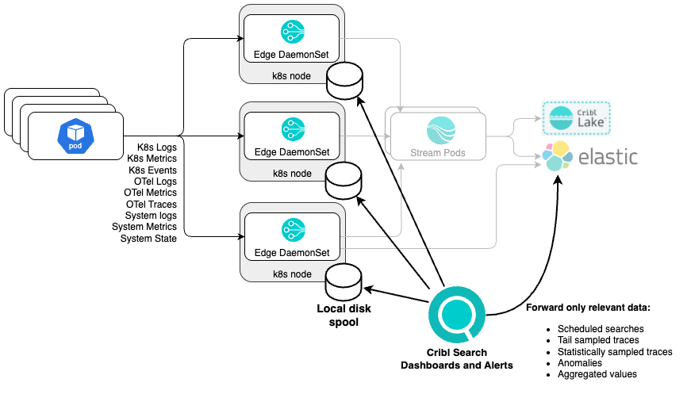
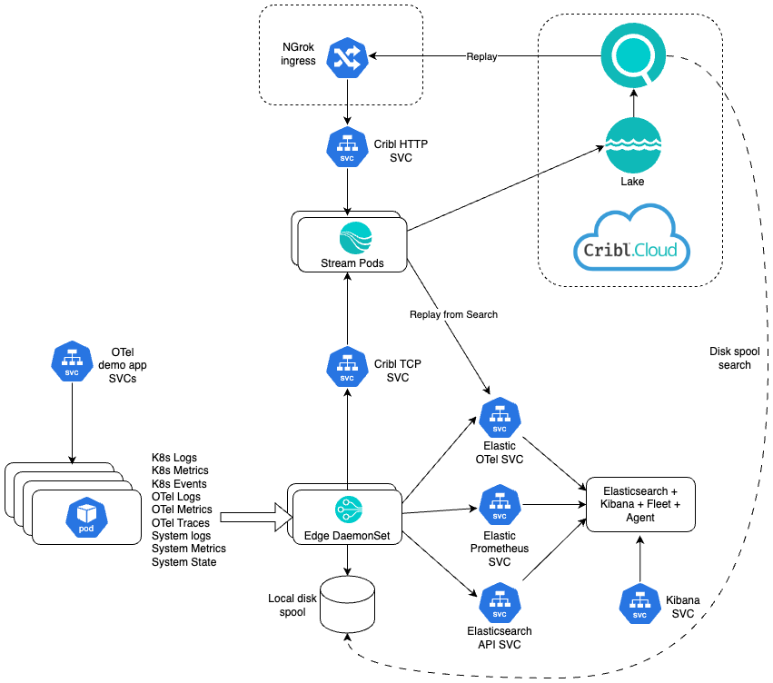

# Kubernetes and application observability demo with Cribl

## [Prerequisites](./PREREQUISITES.md)
* Cribl.Cloud. You know, for Search, Lake, Stream and Edge.
* `kubectl`
* `kind`
* `helm`
* terraform and AWS account for Cloud deployments
* `k9s` - not strictly a must, but super handy when troubleshooting k8s.
* Sign up for ngrok free tier: https://dashboard.ngrok.com/login

## Local setup
The Cribl.Cloud part of the setup only needs to be done once for the Search dashboards, Lake datasets, Edge fleet and Stream Worker Group.
* [Create a `kind` k8s cluster](./kind/SETUP_KIND.md)
* [Deploy Cribl Stream components](./cribl/stream/STREAM_SETUP.md). [Lake](./cribl/lake/LAKE_SETUP.md) instructions included in Stream.
* [Deploy Cribl Edge components](./cribl/edge/EDGE_SETUP.md)
* [Deploy the Elastic stack](./elastic/ELASTIC_SETUP.md)
* [Deploy the `otel-demo` app](./otel-demo/APP_SETUP.md)
* [To support Search replay, deploy the `ngrok` reverse tunnel](./ngrok/NGROK_SETUP.md)
* [Cribl Search setup instructions](./cribl/search/SEARCH_SETUP.md)

## Alternative setup with Terraform 
Requires local install of Terraform, awscli and access to AWS including all the correct values in `~/.aws/credentials`.
* [Alternative setup with Terraform and EC2](./terraform/ec2/SETUP_EC2_TERRAFORM.md)
* [Alternative setup with Terraform and EKS](./terraform/eks/SETUP_EKS_TERRAFORM.md)

## Demo material
* [Presentation](https://docs.google.com/presentation/d/1YpUe1XLNAUBW9JwJXoqTwcCjkkNiwUHTxUXfimFOnck/edit#slide=id.g2e67515ea38_0_847)
* [Recording](https://cribl.zoom.us/rec/share/kUJe_50eWgm4dk1RA48DpbCmC4gv9oxfLui6ZyqD-3PLgppc3flHzOYoOdyXdqkh.ZRROFJhnwAhwUccZ) Password: $hQM2F#w

## Diagrams
### Telemetry forwarding

### Searching directly on Edge

### Overall connectivity
