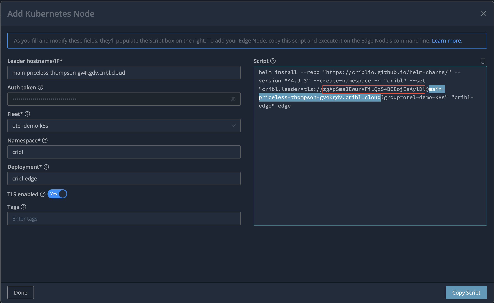
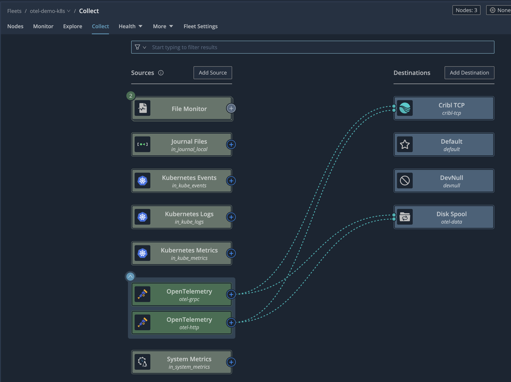

# Configure Cribl Edge
## Create fleet `otel-demo-k8s-fleet`

## Copy the leader URL


## Deploy Cribl Edge DaemonSet
Set the variables:
```bash
export CRIBL_EDGE_VERSION=4.10.0
export CRIBL_EDGE_FLEET=otel-demo-k8s-fleet
export CRIBL_EDGE_LEADER_URL=<leader-url>
export CRIBL_EDGE_TOKEN=<token>
```
Run the `helm install`
```bash
helm install --repo "https://criblio.github.io/helm-charts/" --version "^${CRIBL_EDGE_VERSION}" --create-namespace -n "cribl" \
--set "cribl.leader=tls://${CRIBL_EDGE_TOKEN}@${CRIBL_EDGE_LEADER_URL}?group=${CRIBL_EDGE_FLEET}" \
--set "env.CRIBL_K8S_TLS_REJECT_UNAUTHORIZED=0" \
--values cribl/edge/values.yaml \
"cribl-edge" edge
```

## Create 2 OTel sources, GRPC and HTTP:
<details>
<summary>GRPC OTel source JSON</summary>

```json
{
    "id": "otel-grpc",
    "disabled": false,
    "sendToRoutes": false,
    "pqEnabled": false,
    "streamtags": [],
    "host": "0.0.0.0",
    "port": 4317,
    "tls": {
        "disabled": true
    },
    "protocol": "grpc",
    "extractSpans": true,
    "extractMetrics": true,
    "otlpVersion": "1.3.1",
    "authType": "none",
    "maxActiveCxn": 1000,
    "extractLogs": true,
    "type": "open_telemetry",
    "connections": []
}
```
</details>
<details>
<summary>HTTP OTel source JSON</summary>

```json
{
"id": "otel-http",
"disabled": false,
"sendToRoutes": false,
"pqEnabled": false,
"streamtags": [],
"host": "0.0.0.0",
"port": 4318,
"tls": {
    "disabled": true
},
"maxActiveReq": 256,
"maxRequestsPerSocket": 0,
"requestTimeout": 0,
"socketTimeout": 0,
"keepAliveTimeout": 15,
"enableHealthCheck": false,
"ipAllowlistRegex": "/.*/",
"ipDenylistRegex": "/^$/",
"protocol": "http",
"extractSpans": true,
"extractMetrics": true,
"otlpVersion": "1.3.1",
"authType": "none",
"extractLogs": true,
"maxActiveCxn": 1000,
"type": "open_telemetry",
"connections": []
}
```
</details>

## Create Cribl TCP destination
URL: `cribl-worker-logstream-workergroup`
Port: 10300

Or, simply activate the existing one disabling TLS.

<details>
<summary>Cribl TCP destination JSON</summary>

```json
{
  "id": "cribl-tcp",
  "systemFields": [
    "cribl_pipe"
  ],
  "streamtags": [],
  "loadBalanced": false,
  "compression": "gzip",
  "logFailedRequests": false,
  "throttleRatePerSec": "0",
  "tls": {
    "disabled": true
  },
  "connectionTimeout": 10000,
  "writeTimeout": 60000,
  "tokenTTLMinutes": 60,
  "excludeFields": [
    "__kube_*",
    "__metadata",
    "__winEvent"
  ],
  "onBackpressure": "block",
  "port": 10300,
  "excludeSelf": false,
  "hosts": [
    {
      "port": 10300,
      "tls": "inherit",
      "weight": 1
    }
  ],
  "dnsResolvePeriodSec": 600,
  "loadBalanceStatsPeriodSec": 300,
  "maxConcurrentSenders": 0,
  "type": "cribl_tcp",
  "host": "cribl-worker-logstream-workergroup"
}
```
</details>

## Create Disk Spool destination
Accept all the defaults

## Route both to Stream Cribl TCP destination and Disk spool


## Commit and deploy, test
* Test the sources receiving data. You may need to deploy the `otel-demo` app first.
* Test the destinations are available. You may need to deploy the Stream worker first.
