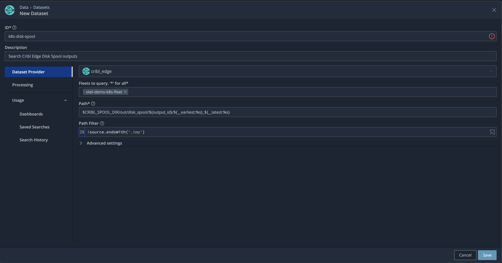

# Set up Cribl Search
## Dataset provider setup
* Name: `k8s_disk_spool`
* Fleets to query: `otel-demo-k8s-fleet`
* Path: `$CRIBL_SPOOL_DIR/out/disk_spool/${output_id}/${__earliest:%s}_${__latest:%s}`
* Path filter: `!source.endsWith('.tmp')`


## Lake Search datasets
Should work out of the box. Replace `k8s_disk_spool` with `otel_traces` or even `otel_*`.

## Test Query to find 10 slowest traces
```k
dataset="k8s_disk_spool" resource.attributes["service.name"]="frontend" name="POST /api/checkout"
// add duration field calculated from start and end times
| extend duration = (end_time_unix_nano - start_time_unix_nano) / 1000000000 
// aggregate by trace_id
| summarize duration=max(duration) by trace_id 
// only show the top 10 (slowest) transactions
| top 10 by duration desc
```

## Install dashboards from the pack
This [pack](./Otel_demo_dashboards_0.0.1.crbl) can be uploaded to Search to create the dashboards to show traces from Lake and k8s Edge DaemonSet disk spools.
Update your replay URL in 2 dashboards two right hand panels each, the dashboard queries (under Interaction tab). Mine look like this:
```
dataset="k8s_disk_spool" trace_id="$value$"
| send tee=true "https://silkworm-shining-instantly.ngrok-free.app"
```