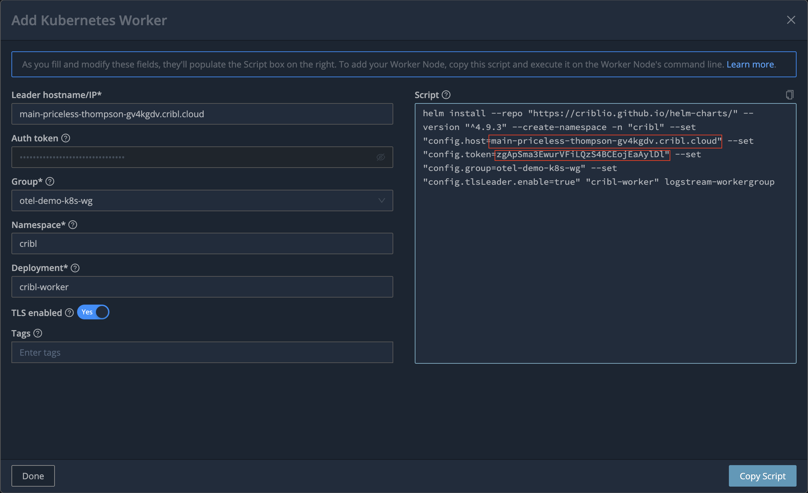

# Deploy Cribl Stream

## Overall design


## Create the worker group `otel-demo-k8s-wg`

## Copy the leader URL and token from `Kubernetes worker setup` dialog


## Deploy Cribl Stream worker
Set the variables:
```bash
export CRIBL_STREAM_TOKEN=<token>
export CRIBL_STREAM_LEADER_URL=<leader-url>
export CRIBL_STREAM_VERSION=4.9.3
export CRIBL_STREAM_WORKER_GROUP=otel-demo-k8s-wg
```
Run the `helm install`
```bash
helm install --repo "https://criblio.github.io/helm-charts/" --version "^${CRIBL_STREAM_VERSION}" --create-namespace -n "cribl" \
--set "config.host=${CRIBL_STREAM_LEADER_URL}" \
--set "config.token=${CRIBL_STREAM_TOKEN}" \
--set "config.group=${CRIBL_STREAM_WORKER_GROUP}" \
--set "config.tlsLeader.enable=true"  \
--set "env.CRIBL_K8S_TLS_REJECT_UNAUTHORIZED=0" \
--set "env.CRIBL_MAX_WORKERS=4" \
--values cribl/stream/values.yaml \
"cribl-worker" logstream-workergroup
```


# Set up the worker group

## Cribl TCP and HTTP Sources
They should already exist, you can simply enable them and send both of them to routes. Disable TLS on TCP source.

### Receive Cribl TCP traffic port 10300
Used to receive the OTel data from Edge Daemonset
<details>
<summary>Cribl TCP source JSON</summary>

```json
    {
        "id": "in_cribl_tcp",
        "disabled": false,
        "sendToRoutes": true,
        "pqEnabled": false,
        "streamtags": [],
        "host": "0.0.0.0",
        "tls": {
            "disabled": true,
            "requestCert": false
        },
        "maxActiveCxn": 1000,
        "enableProxyHeader": false,
        "enableLoadBalancing": false,
        "type": "cribl_tcp",
        "port": 10300,
        "connections": []
    }
```
</details>

### Receive Cribl HTTP traffic port 10200
Used for data replay from Search using `| send <url>`
<details>
<summary>Cribl HTTP source JSON</summary>

```json
    {
        "id": "in_cribl_http",
        "disabled": false,
        "sendToRoutes": true,
        "pqEnabled": false,
        "streamtags": [],
        "host": "0.0.0.0",
        "tls": {
            "disabled": true,
            "requestCert": false
        },
        "maxActiveReq": 256,
        "maxRequestsPerSocket": 0,
        "enableProxyHeader": false,
        "captureHeaders": false,
        "activityLogSampleRate": 100,
        "requestTimeout": 0,
        "socketTimeout": 0,
        "keepAliveTimeout": 5,
        "enableHealthCheck": false,
        "ipAllowlistRegex": "/.*/",
        "ipDenylistRegex": "/^$/",
        "type": "cribl_http",
        "port": 10200,
        "connections": []
    }
```
</details>

## Cribl Lake datasets for Otel traffic
Create 3 Cribl Lake datasets to receive the OTel data:
* `otel_traces`
* `otel_metrics`
* `otel_logs`

We will now create Stream destinations that connect to them.

## Create 3 Stream Lake destinations
You can copy the below JSON or create them manually.
<details>
<summary>otel-traces JSON</summary>

```json
{
  "id": "otel-traces",
  "systemFields": [
    "cribl_pipe"
  ],
  "streamtags": [],
  "awsAuthenticationMethod": "auto",
  "signatureVersion": "v4",
  "reuseConnections": true,
  "rejectUnauthorized": true,
  "enableAssumeRole": false,
  "durationSeconds": 3600,
  "stagePath": "$CRIBL_HOME/state/outputs/staging",
  "addIdToStagePath": true,
  "objectACL": "private",
  "removeEmptyDirs": true,
  "format": "json",
  "baseFileName": "`CriblOut`",
  "fileNameSuffix": "`.${C.env[\"CRIBL_WORKER_ID\"]}.${__format}${__compression === \"gzip\" ? \".gz\" : \"\"}`",
  "maxFileSizeMB": 32,
  "maxOpenFiles": 100,
  "headerLine": "",
  "onBackpressure": "block",
  "maxFileOpenTimeSec": 300,
  "maxFileIdleTimeSec": 30,
  "maxConcurrentFileParts": 4,
  "verifyPermissions": true,
  "maxClosingFilesToBackpressure": 100,
  "compress": "gzip",
  "emptyDirCleanupSec": 300,
  "type": "cribl_lake",
  "destPath": "otel_traces"
}
```
</details>
<details>
<summary>otel-metrics JSON</summary>

```json
{
  "id": "otel-metrics",
  "systemFields": [
    "cribl_pipe"
  ],
  "streamtags": [],
  "awsAuthenticationMethod": "auto",
  "signatureVersion": "v4",
  "reuseConnections": true,
  "rejectUnauthorized": true,
  "enableAssumeRole": false,
  "durationSeconds": 3600,
  "stagePath": "$CRIBL_HOME/state/outputs/staging",
  "addIdToStagePath": true,
  "objectACL": "private",
  "removeEmptyDirs": true,
  "format": "json",
  "baseFileName": "`CriblOut`",
  "fileNameSuffix": "`.${C.env[\"CRIBL_WORKER_ID\"]}.${__format}${__compression === \"gzip\" ? \".gz\" : \"\"}`",
  "maxFileSizeMB": 32,
  "maxOpenFiles": 100,
  "headerLine": "",
  "onBackpressure": "block",
  "maxFileOpenTimeSec": 300,
  "maxFileIdleTimeSec": 30,
  "maxConcurrentFileParts": 4,
  "verifyPermissions": true,
  "maxClosingFilesToBackpressure": 100,
  "compress": "gzip",
  "emptyDirCleanupSec": 300,
  "type": "cribl_lake",
  "destPath": "otel_metrics"
}
```
</details>
<details>
<summary>otel-logs JSON</summary>

```json
{
  "id": "otel-logs",
  "systemFields": [
    "cribl_pipe"
  ],
  "streamtags": [],
  "awsAuthenticationMethod": "auto",
  "signatureVersion": "v4",
  "reuseConnections": true,
  "rejectUnauthorized": true,
  "enableAssumeRole": false,
  "durationSeconds": 3600,
  "stagePath": "$CRIBL_HOME/state/outputs/staging",
  "addIdToStagePath": true,
  "objectACL": "private",
  "removeEmptyDirs": true,
  "format": "json",
  "baseFileName": "`CriblOut`",
  "fileNameSuffix": "`.${C.env[\"CRIBL_WORKER_ID\"]}.${__format}${__compression === \"gzip\" ? \".gz\" : \"\"}`",
  "maxFileSizeMB": 32,
  "maxOpenFiles": 100,
  "headerLine": "",
  "onBackpressure": "block",
  "maxFileOpenTimeSec": 300,
  "maxFileIdleTimeSec": 30,
  "maxConcurrentFileParts": 4,
  "verifyPermissions": true,
  "maxClosingFilesToBackpressure": 100,
  "compress": "gzip",
  "emptyDirCleanupSec": 300,
  "type": "cribl_lake",
  "destPath": "otel_logs"
}
```
</details>

## Create Prometheus destination
Remote Write URL: `http://prometheus.elastic.svc.cluster.local:9201`
<details>
<summary>elastic-prometheus JSON</summary>

```json
{
  "id": "elastic-prometheus",
  "systemFields": [
    "cribl_host",
    "cribl_wp"
  ],
  "streamtags": [],
  "metricRenameExpr": "name.replace(/[^a-zA-Z0-9_]/g, '_')",
  "sendMetadata": true,
  "concurrency": 5,
  "maxPayloadSizeKB": 4096,
  "maxPayloadEvents": 0,
  "rejectUnauthorized": false,
  "timeoutSec": 30,
  "flushPeriodSec": 1,
  "useRoundRobinDns": false,
  "failedRequestLoggingMode": "none",
  "safeHeaders": [],
  "responseRetrySettings": [],
  "timeoutRetrySettings": {
    "timeoutRetry": false
  },
  "responseHonorRetryAfterHeader": false,
  "onBackpressure": "block",
  "authType": "none",
  "metricsFlushPeriodSec": 60,
  "type": "prometheus",
  "url": "http://prometheus.elastic.svc.cluster.local:9201"
}
```
</details>

## Create OTel destination
endpoint (no http://): `apm.elastic.svc.cluster.local:8200`
<details>
<summary>elastic-otel JSON</summary>

```json
{
  "id": "elastic-otel",
  "systemFields": [
    "cribl_pipe"
  ],
  "streamtags": [],
  "protocol": "grpc",
  "otlpVersion": "1.3.1",
  "compress": "gzip",
  "authType": "none",
  "concurrency": 5,
  "maxPayloadSizeKB": 4096,
  "timeoutSec": 30,
  "flushPeriodSec": 1,
  "failedRequestLoggingMode": "none",
  "connectionTimeout": 10000,
  "keepAliveTime": 30,
  "onBackpressure": "block",
  "tls": {
    "disabled": true
  },
  "type": "open_telemetry",
  "endpoint": "apm.elastic.svc.cluster.local:8200"
}
```
</details>

## Install `cribl-opentelemetry` pack from Dispensary
It is used to translate OTel traces into metrics

## Create `metrics-to-elastic` pipeline
Create the `metrics-to-elastic` pipeline and copy the following JSON.
<details>
<summary>metrics-to-elastic JSON</summary>

```json
{
  "id": "metrics-to-elastic",
  "conf": {
    "output": "default",
    "streamtags": [],
    "groups": {},
    "asyncFuncTimeout": 1000,
    "functions": [
      {
        "id": "comment",
        "filter": "true",
        "conf": {
          "comment": "Invoke the OTel to metrics pack"
        }
      },
      {
        "id": "chain",
        "filter": "true",
        "conf": {
          "processor": "pack:cribl-opentelemetry"
        },
        "description": "Invoke the Cribl OpenTelemetry pack"
      },
      {
        "id": "comment",
        "filter": "true",
        "conf": {
          "comment": "Reduce the granularity of metrics by aggregating them"
        }
      },
      {
        "id": "aggregation",
        "filter": "true",
        "disabled": false,
        "conf": {
          "passthrough": false,
          "preserveGroupBys": false,
          "sufficientStatsOnly": false,
          "metricsMode": true,
          "timeWindow": "60s",
          "aggregations": [
            "sum(duration).as(duration)",
            "sum(http_2xx).as(http_2xx)",
            "sum(http_3xx).as(http_3xx)",
            "sum(http_4xx).as(http_4xx)",
            "sum(http_5xx).as(http_5xx)",
            "sum(otel_status_0).as(otel_status_0)",
            "sum(otel_status_1).as(otel_status_1)",
            "sum(otel_status_2).as(otel_status_2)",
            "sum(requests_error).as(requests_error)",
            "sum(requests_total).as(requests_total)",
            "max(start_time_unix_nano).as(max_starttime)"
          ],
          "cumulative": false,
          "flushOnInputClose": false,
          "groupbys": [
            "service",
            "resource_url",
            "status_code"
          ]
        },
        "description": "Aggregate metrics before sending them"
      },
      {
        "id": "comment",
        "filter": "true",
        "conf": {
          "comment": "Fix the timestamp to max_time of the aggregated spans"
        }
      },
      {
        "id": "auto_timestamp",
        "filter": "true",
        "conf": {
          "srcField": "max_starttime",
          "dstField": "_time",
          "defaultTimezone": "UTC",
          "timeExpression": "time.getTime() / 1000",
          "offset": 0,
          "maxLen": 150,
          "defaultTime": "now",
          "latestDateAllowed": "+1week",
          "earliestDateAllowed": "-420weeks"
        }
      }
    ]
  }
}
```
</details>

## Update the routes
Use the following JSON to install the routes
<details>
<summary>routes JSON</summary>

```json
{
  "id": "default",
  "groups": {},
  "comments": [],
  "routes": [
    {
      "id": "3LhVQf",
      "name": "Drop non-OTel traffic",
      "final": true,
      "disabled": false,
      "pipeline": "passthru",
      "description": "",
      "clones": [],
      "enableOutputExpression": false,
      "filter": "!__otlp.type",
      "output": "devnull"
    },
    {
      "id": "atAndy",
      "name": "Send logs, metrics and traces to Lake",
      "final": false,
      "disabled": false,
      "pipeline": "passthru",
      "description": "",
      "clones": [
        {}
      ],
      "enableOutputExpression": false,
      "filter": "true",
      "output": "otel-router-to-lake"
    },
    {
      "id": "Dk4BhU",
      "name": "Create RED metrics from OTel traces",
      "final": false,
      "disabled": false,
      "pipeline": "metrics-to-elastic",
      "description": "",
      "clones": [
        {}
      ],
      "enableOutputExpression": false,
      "filter": "__otlp.type == 'traces'",
      "output": "elastic-prometheus"
    },
    {
      "id": "IDxs9F",
      "name": "Send everything to Elastic",
      "final": false,
      "disabled": true,
      "pipeline": "passthru",
      "description": "",
      "clones": [
        {}
      ],
      "enableOutputExpression": false,
      "filter": "true",
      "output": "elastic-otel"
    },
    {
      "id": "default",
      "name": "default",
      "final": true,
      "disabled": false,
      "pipeline": "devnull",
      "description": "",
      "clones": [],
      "enableOutputExpression": false,
      "filter": "true",
      "output": "devnull"
    }
  ]
}
```
</details>

## Commit and deploy, test
* Test the data flowing through sources. You may need to deploy Edge and `otel-demo` first.
* Test the destinations are available. You may need to deploy the Elastic stack first.