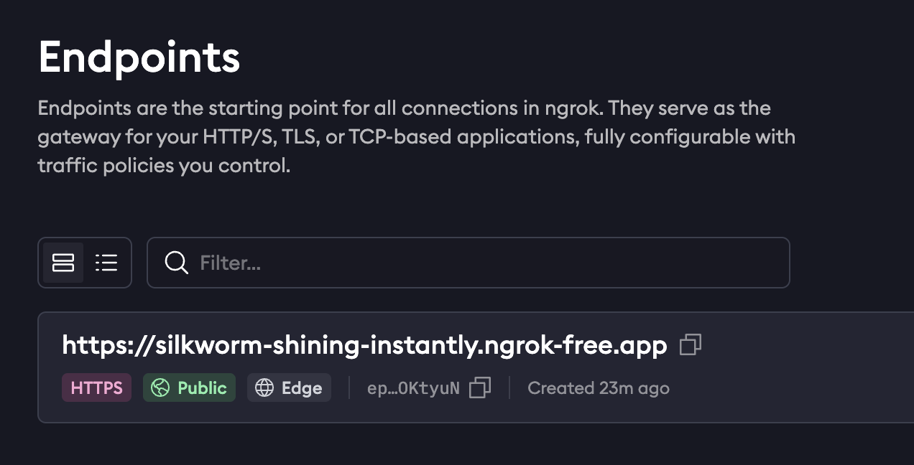

# Deploy ngrok agent

## Using helm, add the ngrok repo:
```
helm repo add ngrok https://charts.ngrok.com
```

## Create a Free Ngrok Account
Start by creating a free account on Ngrok. This will allow you to access the necessary tools to expose your local server.

## Set Up a Static Domain
Once your account is set up, go to Cloud Edge > Domains in your Ngrok dashboard. Click on the + Create Domain button to create a new free static domain. Make sure to copy your new domain name for the next steps.

## Set your environment variables with your ngrok credentials. 
Replace [AUTHTOKEN] and [API_KEY] with your Authtoken and API key.
* Auth token: https://dashboard.ngrok.com/get-started/your-authtoken
* API keys: https://dashboard.ngrok.com/api-keys
```bash
export NGROK_AUTHTOKEN=[AUTHTOKEN]
export NGROK_API_KEY=[API_KEY]
```

## Install the ngrok Kubernetes Operator
```bash
helm install ngrok-ingress-controller ngrok/kubernetes-ingress-controller \
  --namespace ngrok-ingress-controller \
  --create-namespace \
  --set credentials.apiKey=${NGROK_API_KEY} \
  --set credentials.authtoken=${NGROK_AUTHTOKEN}
```

## Create a domain in ngrok and update its name in `ngrok/ngrok-manifest.yaml`
Mine looks like the following, yours will be different. So, configure it in Ngrok and update the manifest.


## Apply the manifest file to your k8s cluster.
```
kubectl apply -f ngrok/ngrok-manifest.yaml
```